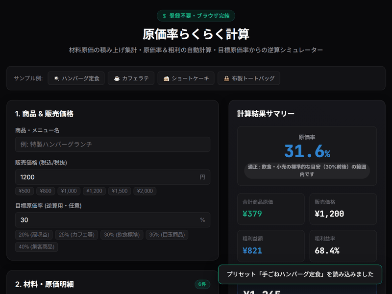

# 原価率らくらく計算

商品・メニューの販売価格と原価から、原価率・粗利・粗利率をすぐに確認できる無料・登録不要のWebツールです。

原価を入力して計算するだけでなく、**目標原価率から必要な販売価格を逆算**できることを中心機能とします。




## コンセプト

「原価率を計算する」だけではなく、商品価格を決めるときに発生する計算を、その場で簡単に片付けることを目的とします。

主な対象は、

- 原価率の計算
- 粗利・粗利率の計算
- 目標原価率から販売価格の逆算
- 複数材料から商品原価の集計
- 材料単位の原価計算

です。

## 主な特徴

- **無料・登録不要**: ログインなしですぐ利用できます。
- **ブラウザ完結**: 基本的な計算をブラウザ内で処理します。
- **材料の複数行入力**: 材料名・使用量・仕入単価をまとめて入力できます。
- **材料原価の自動集計**: 各材料の原価を計算し、商品原価を自動集計します。
- **原価率の自動計算**: 販売価格と商品原価から原価率を算出します。
- **粗利・粗利率の表示**: 商品ごとの利益額と利益率を確認できます。
- **販売価格の逆算**: 原価と目標原価率から必要な販売価格を計算できます。
- **単位を考慮した計算**: g / kg、ml / L、個など、入力内容に応じて計算できる構成とします。
- **結果の一括コピー**: 計算結果をまとめてコピーできます。
- **スマートフォン対応**: PCだけでなくスマートフォンでも使いやすいUIを想定します。

## 計算例

### 原価率

```text
販売価格      1,000円
商品原価        280円

原価率          28.0%
粗利            720円
粗利率          72.0%
```

原価率は、

```text
原価率 = 商品原価 ÷ 販売価格 × 100
```

で計算します。

### 目標原価率から販売価格を逆算

```text
商品原価        280円
目標原価率       30%

必要販売価格    約934円
```

販売価格は、

```text
販売価格 = 商品原価 ÷ 目標原価率
```

で逆算します。

## 材料原価の計算

例えば、

```text
ひき肉      150g    1kg 1,200円
玉ねぎ       50g    1kg   200円
卵            1個       25円
```

と入力した場合、各材料の使用量と仕入単価から材料原価を計算し、商品原価を集計します。

## 利用イメージ

```text
材料入力
   ↓
材料原価を計算
   ↓
商品原価を集計
   ↓
販売価格を入力
   ↓
原価率・粗利・粗利率を表示
   ↓
必要なら目標原価率から販売価格を逆算
```

## プライバシー

基本的な計算処理はブラウザ内で完結することを基本方針とします。

入力した原価情報を外部サーバーへ送信することを前提としません。

## 対象

飲食・食品販売などで、商品やメニューの原価率を手早く確認したいケースを主な対象とします。

## ライセンス

[MIT License](LICENSE) (c) 2026 tk030

```text
MIT License

Copyright (c) 2026 tk030

Permission is hereby granted, free of charge, to any person obtaining a copy
of this software and associated documentation files (the "Software"), to deal
in the Software without restriction, including without limitation the rights
to use, copy, modify, merge, publish, distribute, sublicense, and/or sell
copies of the Software, and to permit persons to whom the Software is
furnished to do so, subject to the following conditions:

The above copyright notice and this permission notice shall be included in all
copies or substantial portions of the Software.

THE SOFTWARE IS PROVIDED "AS IS", WITHOUT WARRANTY OF ANY KIND, EXPRESS OR
IMPLIED, INCLUDING BUT NOT LIMITED TO THE WARRANTIES OF MERCHANTABILITY,
FITNESS FOR A PARTICULAR PURPOSE AND NONINFRINGEMENT. IN NO EVENT SHALL THE
AUTHORS OR COPYRIGHT HOLDERS BE LIABLE FOR ANY CLAIM, DAMAGES OR OTHER
LIABILITY, WHETHER IN AN ACTION OF CONTRACT, TORT OR OTHERWISE, ARISING FROM,
OUT OF OR IN CONNECTION WITH THE SOFTWARE OR THE USE OR OTHER DEALINGS IN THE
SOFTWARE.
```
